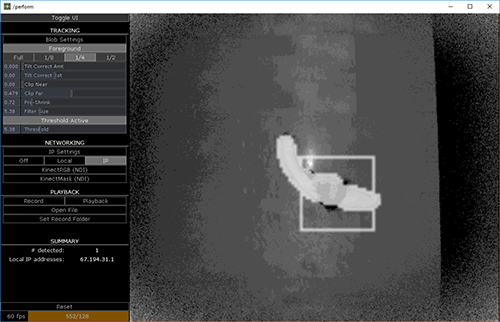

# Kinect Floor Track 099
by [L05](http://L05.is)

There are two components:

KinectFloorTrack_099.1.tox
- main component that pulls in data from Kinect and returns blob tracking data and has network options for sending to a separate local or remote instance.

KinectFloorTrack_receiver_099.1.tox
- secondary component that receives network data from main component.

I've also uploaded a sample video of recorded Kinect data (too big to attach):
https://www.dropbox.com/s/j9qgsz82vpgkont/KinectFloorTrack_testvideo.rar

[Related TouchDesigner Forum Thread](http://derivative.ca/Forum/viewtopic.php?f=22&t=10867&p=42981&hilit=kinect+floor+track#p41659)

## Description

Module for tracking multiple people on a clear, flat floor space using a Kinect v2. Recommended position for the Kinect is approximately 14-15 feet (~4.5 meters) above the floor, pointed directly down, perpendicular to the floor plane. The tilt correct feature provides some correction for placement of kinect at angles.

Currently all tracking data is normalized and outputted via data_out. The number of blobs and input tracking resolution are outputted via summary_out. The tracking data itself is outputted via data_out.

I've run this module as its own instance, both locally and over a network. Data is sent to a local Touch instance via shared memory and to a networked Touch instance via IP.

This has been tested successfully on an Intel NUC i5-6260U, which makes it great for tucking into elevated spaces and extending over Cat-5e or Cat-6.

If you use this and/or improve upon it, please let me know. Feedback is encouraged!

##### 099.1
##### 2017.05.26
Updated so that it runs on TouchDesigner 099 and uses the new Blobtrack TOP.

Made the following feature changes:
- Input resolution selection expanded to include full, eighth, quarter, and half resolution.
- Sliders now have manual value input.
- Tilt correct slightly adjusted/improved.
- UI controls for input blur.
- Ability to send KinectMask (input matte to tracking) and KinectRGB (low-res RGB feed) over network via NDI Out.
- Basic record and playback feature for recording test files.
- Listing of local IP addresses for easy referral when doing networked setups.
- Added custom parameters to COMPs for increased modularity.
- Changed the UI COMP name from 'Left' to 'UI'.

Removed the following features:
- Tag system (not worth overhead).

Notes:
- The Blobtrack TOP in 099 doesn't seem to be quite as solid as the one in 088. It takes longer to process each frame and seems to drop tracking sometimes.
- The Shared Mem Out CHOP and NDI Out TOPs only work in the Educational, Commercial, and Pro versions of TouchDesigner. Additionally, you will only be able to track up to one blob in the Non-Commercial version.
