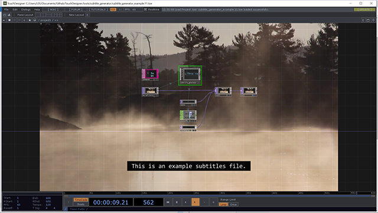

# Subtitle Generator

I created a simple SRT file importer and corresponding subtitle generator for a couple small projects and figured it useful to share in case anyone else might benefit.

Nothing fancy here, mostly operators and some light python, commented for clarity.
I've also separated some of the sub-components into their own TOX files in case someone is interested only in a specific part.

Related TouchDesigner [forum thread](http://derivative.ca/Forum/viewtopic.php?f=22&t=19096).

