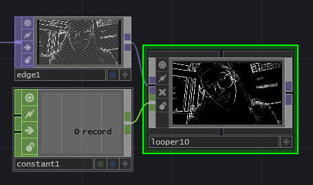

# Video Looper TOX + Example TOE

[Related TouchDesigner Forum Thread](http://derivative.ca/Forum/viewtopic.php?f=22&t=10207&hilit=video+looper)

After helping with some Cache TOP related questions on the Facebook group, I realized I couldn't find any simple looper examples and decided to make one.

I've uploaded a looper.tox file that takes a TOP input for video capture and a CHOP input as a record signal. Video is cached using a Cache TOP and automatically scrubbed through with LFO CHOPs.

The looper has several custom parameters under its Looper page:

**Record** -- toggle on to capture a loop. Once toggled off, the loop will automatically play back according to the Loop Mode.

**Cache Size** -- linked directly to the Cache TOP's cache size parameter. This will determine the maximum length of your loop. Larger cache size equates to more GPU memory usage.

**Loop Mode** -- there are three loop modes: Normal plays the loop straight through, Ping-Pong (Eased) plays back and forth in a sinusoidal fashion, and Ping-Pong (Linear) plays back and forth at constant speed.

**Loop Speed** -- loop playback speed.

**Interpolate** -- linked directly to the Cache TOP's interpolate parameter. This will interpolate the video for smoother playback at slow speeds.

**Mono (Reduce GPU Mem)** -- this will set the input video texture pixel format to 8-bit fixed (Mono) in order to reduce GPU memory usage.

**Save** -- click to save your loop as a HAP Q encoded video file.

**File Name** -- give your exported file a name before saving.

My personal aim was to implement most of it in CHOPs, and I tried to comment thoroughly to aid anyone learning or wanting to hack it. You'll also find a multi_looper.toe file with an example of multiple looper modules being simultaneously used.

Hope this is helpful! Feedback encouraged.
